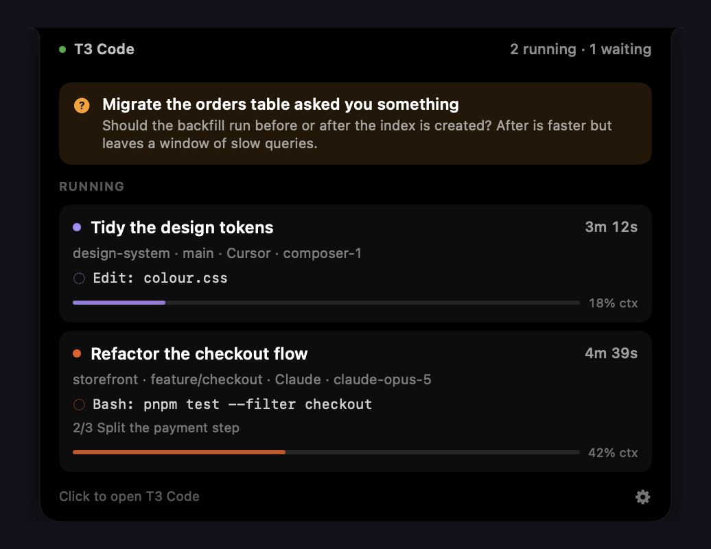
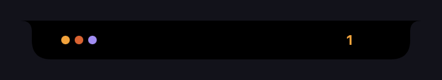
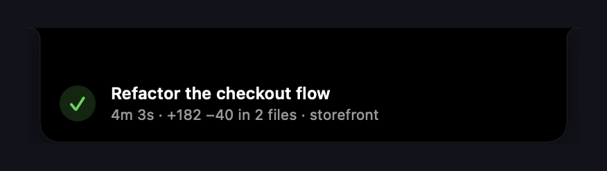
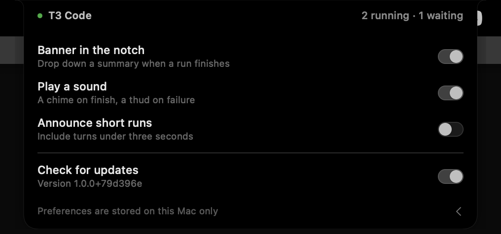

<div align="center">

# T3 Notch

**Your [T3 Code](https://github.com/pingdotgg/t3code) agents, in the notch.**

[](https://github.com/tmmywatsn/t3notch/actions/workflows/ci.yml)
[](#install)
[](#how-it-works)
[](LICENSE)

</div>

It stays invisible until an agent is doing something, shows what's running at a glance, and drops a
banner when a run finishes. No token, no pairing, no `t3` CLI — it reads the state T3 Code already
writes to disk.

<div align="center">
  
</div>

## What it shows

Point at the notch and it opens: **anything waiting on you first**, then each running agent with its
project, branch, model, elapsed time, the command in flight, plan progress and context usage. Then
recent completions, held until you've looked at them or half an hour passes.

Collapsed, it's two clusters either side of the cutout. Nothing animates.

<div align="center">
  
</div>

**Left — one dot per live thread:**

| Colour | Meaning |
| --- | --- |
| Amber | Wants your input, approval, or a plan reviewed |
| Red | Failed |
| Provider colour | Working |
| Dimmed | Starting up |

**Right — a count**, taking the first that applies: amber if any thread wants you, a green ✓ (red ✗
on failure) if nothing is live but a finish is unread, otherwise white for the number working. A
ring appears once a working thread passes 80% of its context window, turning red past 92%.

Newest sits closest to the cutout; older threads trail away from it and wrap onto a second row. The
sort key is when the run started, so nothing reshuffles while an agent works.

<div align="center">
  
</div>

## Install

Requires **macOS 14+**, T3 Code, and the Xcode Command Line Tools.

```sh
git clone https://github.com/tmmywatsn/t3notch.git
cd t3notch
./Scripts/build-app.sh
cp -R "build/T3 Notch.app" /Applications/
open "/Applications/T3 Notch.app"
```

Launch it from `/Applications` rather than `build/`, which is rebuilt in place. To start it
automatically, add it under **System Settings → General → Login Items → Open at Login**.

> [!NOTE]
> Releases are source-only. Builds here are ad-hoc signed, so a downloaded `.app` would be
> quarantined by Gatekeeper.

On a Mac without a physical notch it uses a 190pt region in the middle of the menu bar instead;
everything else behaves the same.

## Settings

The cog at the bottom right of the open panel.

<div align="center">
  
</div>

| Setting | Default | Controls |
| --- | --- | --- |
| Banner in the notch | On | The drop-down summary when a run finishes |
| Play a sound | On | A chime on finish, a thud on failure, a ping when you're asked something |
| Announce short runs | Off | Whether turns under three seconds count as a run |

Two more — Notification Centre banners and Start at login — appear only on a build signed with a
Developer ID, since macOS refuses both to ad-hoc signed apps.

## How it works

T3 Code's HTTP API needs a paired credential, so instead of polling it the app tails the state T3
Code already writes to disk: a `stat()` on the SQLite database and its WAL four times a second, then
read-only queries against the projection tables when something has changed.

> [!IMPORTANT]
> Those tables are T3 Code's private storage, not a published API, so an upstream change could
> rename them. Every query is defensive — a missing table shows "Waiting for T3 Code" rather than
> crashing — and they all live in [`T3Database.swift`](Sources/T3Notch/Model/T3Database.swift).

[`docs/internals.md`](docs/internals.md) covers the alternatives that were measured and rejected,
the thread status vocabulary, and why clicking through to a specific thread isn't possible yet.

## Privacy

- Reads `~/.t3/userdata/state.sqlite` **read-only**, `stat()`s the WAL beside it, and reads
  `settings.json` for your provider accent colours. Nothing else — never `clerk-tokens.json` or
  `secrets/`.
- Writes four booleans to `UserDefaults` and keeps no other state.
- **No networking code and no telemetry.** The only dependencies are Apple frameworks and
  `libsqlite3`.

## Development

```sh
./Scripts/test.sh        # pure-logic assertions
./Scripts/build-app.sh   # builds build/T3 Notch.app
```

`Scripts/fixture.sh` builds a throwaway database so you can drive every state without T3 Code
running:

```sh
./Scripts/fixture.sh setup && ./Scripts/fixture.sh seed
T3NOTCH_USERDATA=/tmp/t3notch-fixture "build/T3 Notch.app/Contents/MacOS/T3Notch" &
./Scripts/fixture.sh run      # working
./Scripts/fixture.sh ask      # a question
./Scripts/fixture.sh finish   # completion banner
./Scripts/fixture.sh fail     # failure banner
```

`T3NOTCH_DEBUG=1` logs frame and event decisions to stderr. `T3NOTCH_PREVIEW=1` fires a sample
banner at launch.

Some Command Line Tools installs ship a stale `module.modulemap` that breaks any AppKit import. The
build script works around it; `sudo ./Scripts/fix-toolchain.sh` removes it properly.

## Contributing

Issues and pull requests welcome.

`main` is protected: CI must be green on both macOS 14 and latest before a pull request can merge,
and history stays linear. Add an assertion to `Tests/main.swift` for anything with logic in it.

## Licence

[MIT](LICENSE). Not affiliated with, endorsed by, or sponsored by T3 or T3 Code.
